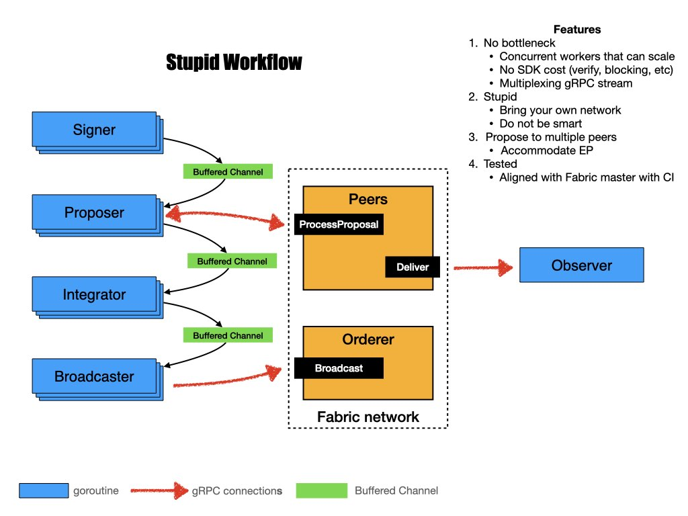

# A simple traffic generator for Hyperledger Fabric

English/[中文](docs/whatis.md)

[](https://dev.azure.com/guojiannan1101/guojiannan1101/_build/latest?definitionId=1&branchName=master)
## Why Tape

Sometimes we need to test performance of a deployed Fabric network with ease. There are many excellent projects out there, i.e. Hyperledger Caliper. However, we sometimes just need a tiny, handy tool, like `tape`.

## What is it

This is a very simple traffic generator:
- it does not use any SDK
- it does not attempt to deploy Fabric
- it does not rely on connection profile
- it does not discover nodes, chaincodes, or policies
- it does not monitor resource utilization

It is used to perform super simple performance test:
- it directly establishes number of gRPC connections
- it sends signed proposals to peers via number of gRPC clients
- it assembles endorsed responses into envelopes
- it sends envelopes to orderer
- it observes transaction commitment

Our main focus is to make sure that *tape will not be the bottleneck of performance test*

## Usage

### Install

You could get `tape` in three ways:
1. Download binary: get release tar from [release page](https://github.com/guoger/tape/releases), and extract `tape` binary from it
2. Build from source: clone this repo and run `go build ./cmd/tape` at root dir. Go1.11 or higher is required.
3. Pull docker image: `docker pull guoger/tape`

### Configure

Modify `config.yaml` according to your network. This is a sample:
```yaml
endorsers:
  - addr: localhost:7051
    tls_ca_cert: /path/to/peer1/tls/ca/cert
  - addr: localhost:7051
    tls_ca_cert: /path/to/peer2/tls/ca/cert
committer:
  addr: localhost:7051
  tls_ca_cert: /path/to/peer2/tls/ca/cert
orderer:
  addr: localhost:7050
  tls_ca_cert: /path/to/orderer/tls/ca/cert
channel: mychannel
chaincode: basic
args:
  - GetAllAssets
mspid: Org1MSP
private_key: ./organizations/peerOrganizations/org1.example.com/users/User1@org1.example.com/msp/keystore/priv_sk
sign_cert: ./organizations/peerOrganizations/org1.example.com/users/User1@org1.example.com/msp/signcerts/User1@org1.example.com-cert.pem
num_of_conn: 10
client_per_conn: 10
```

`endorsers`: include the addr and tls ca cert of peers. Peer address is in IP:Port format. You may need to add peer name, i.e. `peer0.org1.example.com,peer0.org2.example.com` to your `/etc/hosts`

`committer`: observe tx commitment from these peers.

`orderer`: include the addr and tls ca cert of orderer. Orderer address is in IP:Port format. It does not support sending traffic to multiple orderers, yet. You may need to add orderer name, i.e. `orderer.example.com` to your `/etc/hosts`

This tool sends traffic as a Fabric user, and requires following configs

`mspid`: MSP ID that the user is associated to

`private_key`: path to the private key. If you are using BYFN as your base, this can be:
```
crypto-config/peerOrganizations/org1.example.com/users/User1@org1.example.com/msp/keystore/priv_sk
```

`sign_cert`: path to the user certificate. If you are using BYFN as your base, this can be:
```
crypto-config/peerOrganizations/org1.example.com/users/User1@org1.example.com/msp/signcerts/User1@org1.example.com-cert.pem
```

`channel`: channel name

`chaincode`: chaincode to invoke. There is an example chaincode in `chaincodes/sample.go`, which simply puts `key:value`. This is closely related to `args` parameter.

`version`: the version of chaincode. This is left to empty by default.

`args`: arguments to send with invocation, depending on your chaincode implementation. The chaincode used by this sample can be found in `chaincodes/sample.go`

`num_of_conn`: number of gRPC connection established between client/peer, client/orderer. If you think client has not put enough pressure on Fabric, increase this.

`client_per_conn`: number of clients per connection used to send proposals to peer. If you think client has not put enough pressure on Fabric, increase this.

### Run

#### Binary

Execute `./tape -c config.yaml -n 40000` to generate 40000 transactions to Fabric.

#### Docker

```
docker run -v $PWD:/tmp guoger/tape tape -c $CONFIG_FILE -n 40000
```

*Set this to integer times of batchsize, so that last block is not cut due to timeout*. For example, if you have batch size of 500, set this to 500, 1000, 40000, 100000, etc.

## Tips

- Put this generator closer to Fabric, or even on the same machine. This is to prevent network bandwidth from being the bottleneck.

- Increase number of messages per block in your channel configuration may help

## Help us improve

If you wish for new features or encounter any bug, please feel free to open [issue](https://github.com/guoger/tape/issues), and we always welcome [pull request](https://github.com/guoger/tape/pulls).

If you are reporting an issue, please generously turn on debug log with `export TAPE_LOGLEVEL=debug` and paste log in the issue

## Development
<details>
<summary>Click to expand</summary>

### Tape workflow

Tape consists of several workers that run in goroutines, so that the pipeline is highly concurrent and scalable. Workers are connected via buffered channels, so they can pass products around.



### log

We use [logrus](https://github.com/sirupsen/logrus) for logging, which can be set with env var `export TAPE_LOGLEVEL=debug`.
Here are possbile values (warn by default)
`"panic", "fatal", "error", "warn", "warning", "info", "debug", "trace"`

</details>
