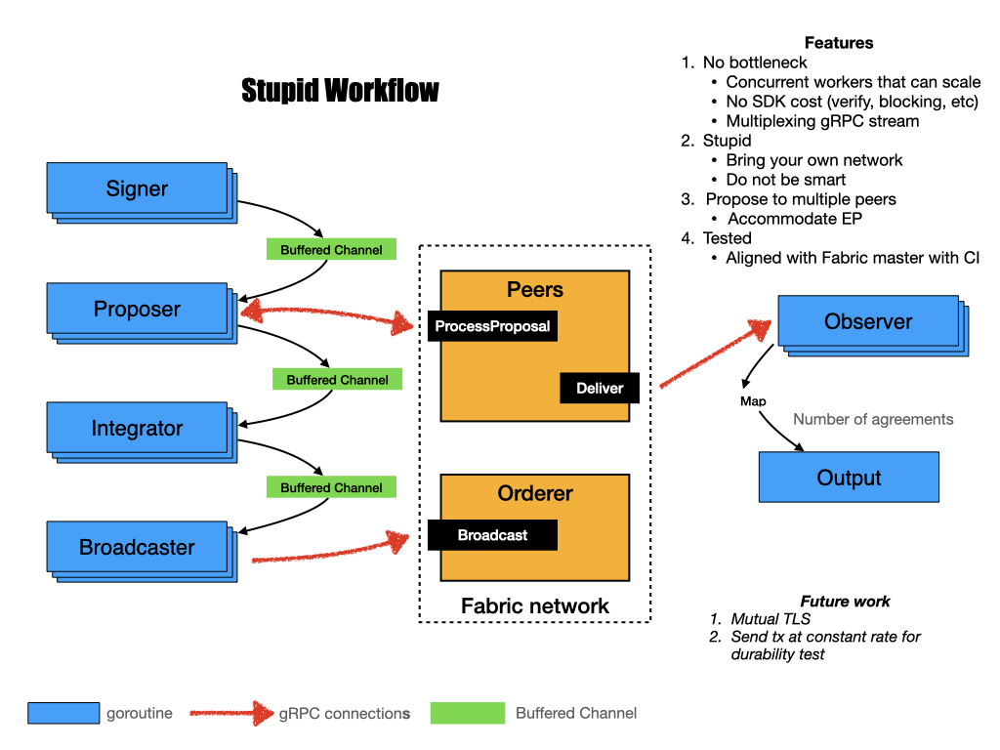

# A Stupid traffic generator for Fabric

[](https://dev.azure.com/guojiannan1101/guojiannan1101/_build/latest?definitionId=1&branchName=master)

## What is it
Sometimes we need to test performance of a deployed Fabric network with ease. There are many excellent projects out there, i.e. Hyperledger Caliper. However, we sometimes just need a tiny, handy tool, like `stupid`, [Keep It Simple, Stupid.](https://en.wikipedia.org/wiki/KISS_principle)

This is a very stupid traffic generator:
- it does not use any SDK
- it does not attempt to deploy Fabric
- it does not rely on connection profile
- it does not discover nodes, chaincodes, or policies
- it does not monitor resource utilization

It is used to perform super simple performance test:
- it directly establishes number of gRPC connections
- it makes traffic as a Fabric user
- it sends signed proposals to peers via number of gRPC clients
- it assembles endorsed responses into envelopes
- it sends envelopes to orderer
- it observes transaction commitment

This tool is so stupid that *it will not be the bottleneck of performance test*

## Prerequisites

Go1.11 or higher. Go1.14 is recommended.

## Install

You need to build from source for now (Docker image on the way).

Clone this repo and run `go build ./cmd/stupid` at root dir. This is a go module project so you don't need to clone it into `GOPATH`. It will download required dependencies automatically, which may take a while depending on network connection. Once it finishes building, you should have a executable named `stupid`.

## Configure

Modify [config.yaml](./config.yaml) according to your network. This is a sample:
```yaml
# Definition of nodes
peer1: &peer1
  addr: localhost:7051
  tls_ca_cert: /path/to/peer1/tls/ca/cert
peer2: &peer2
  addr: localhost:9051
  tls_ca_cert: /path/to/peer1/tls/ca/cert

orderer1: &orderer1
  addr: localhost:7050
  tls_ca_cert: /path/to/peer1/tls/ca/cert

# Nodes to interact with
endorsers:
  - *peer1
  - *peer2
committer: *peer2
orderer: *orderer1

# Invocation configs
channel: mychannel
chaincode: basic
args:
  - GetAllAssets
mspid: Org1MSP
private_key: ./path/to/priv_sk
sign_cert: ./path/to/signcerts
num_of_conn: 10
client_per_conn: 10
```

<details>
<summary>node</summary>

Includes addr and tls ca cert of peers/orderer. Address is in IP:Port format. You may need to add host name, i.e. `peer0.org1.example.com,peer0.org2.example.com` to your `/etc/hosts` 

```
node: &node
  addr:         peer0.org1.example.com:7051
  tls_ca_cert:  /path/to/peer1/tls/ca/cert
```
<details>
<summary>Further config with tls</summary>

```
node: &node
  addr:         peer0.org1.example.com:7051
  tls_ca_cert:  TLS server cert or mTLS client cert
  tls_ca_key:   mTLS client key
  tls_ca_root:  mTLS ca root
```


For non TLS
```
node: &node
  addr:         peer0.org1.example.com:7051
```

For TLS
```
node: &node
  addr:         peer0.org1.example.com:7051
  tls_ca_cert:  peer0.org1.example.com-cert.pem
```

For MTLS
```
node: &node
  addr:         peer0.org1.example.com:7051
  tls_ca_cert:  User1@org1.example.com/tls/client.crt
  tls_ca_key:   User1@org1.example.com/tls/client.key
  tls_ca_root:  User1@org1.example.com/tls/ca.crt
```
</details>
</details>

<details>
<summary>endorsers</summary>

an array of peers which meet the endorsement policy. Each peer defined as node structure.
```
endorsers:
  - *peer1
  - *peer2
```
</details>

<details>
<summary>committer</summary>

observe tx commitment from these peer, defined as node structure.
```
committer: *peer2
```
</details>

<details>
<summary>orderer</summary>

 The orderer where we send envelopes to, defined as node structure.
```
orderer: *orderer1
```
</details>

<details>
<summary>mspid</summary>

MSP ID that the user is associated to.
</details>

<details>
<summary>private_key</summary>

path to the private key. If you are using BYFN as your base, this can be:
```
crypto-config/peerOrganizations/org1.example.com/users/User1@org1.example.com/msp/keystore/priv_sk
```
</details>

<details>
<summary>sign_cert</summary>

path to the user certificate. If you are using BYFN as your base, this can be:
```
crypto-config/peerOrganizations/org1.example.com/users/User1@org1.example.com/msp/signcerts/User1@org1.example.com-cert.pem
```
</details>

<details>
<summary>channel</summary>

channel name.
</details>

<details>
<summary>chaincode</summary>

chaincode to invoke.
</details>

<details>
<summary>version</summary>

the version of chaincode. This is left to empty by default.
</details>

<details>
<summary>args</summary>

arguments to send with invocation, depending on your chaincode implementation.
</details>

<details>
<summary>num_of_conn</summary>

number of gRPC connection established between client/peer, client/orderer. If you think client has not put enough pressure on Fabric, increase this.
</details>

<details>
<summary>client_per_conn</summary>

number of clients per connection used to send proposals to peer. If you think client has not put enough pressure on Fabric, increase this.
</details>

## Logging

We use [logrus](https://github.com/sirupsen/logrus) for logging, pls set log level by envrionment as `export STUPID_LOGLEVEL=debug`.

by default is warn level.
`"panic", "fatal", "error", "warn", "warning", "info", "debug", "trace"`

## Run

Execute `./stupid config.yaml 40000` to generate 40000 transactions to Fabric.

*Set this to integer times of batchsize, so that last block is not cut due to timeout*. For example, if you have batch size of 500, set this to 500, 1000, 40000, 100000, etc.

## Development

If you wish for new features or encounter any bug, please feel free to open [issue](https://github.com/guoger/stupid/issues), and we always welcome [pull request](https://github.com/guoger/stupid/pulls).

### Stupid workflow

Stupid consists of several workers that run in goroutines, so that the pipeline is highly concurrent and scalable. Workers are connected via buffered channels, so they can pass products around.



## Tips

- Put this generator closer to Fabric, on even on the same machine. This is to prevent network bandwidth from being the bottleneck. You can use tools like `iftop` to monitor network traffic.

- Observe cpu status of peer with tools like `top`. You should see CPUs being exhausted at the beginning of test, that is peer processing proposals. It should be fairly quick, then you'll see blocks are being committed one after another.

- Increase number of messages per block in your channel configuration may help 
