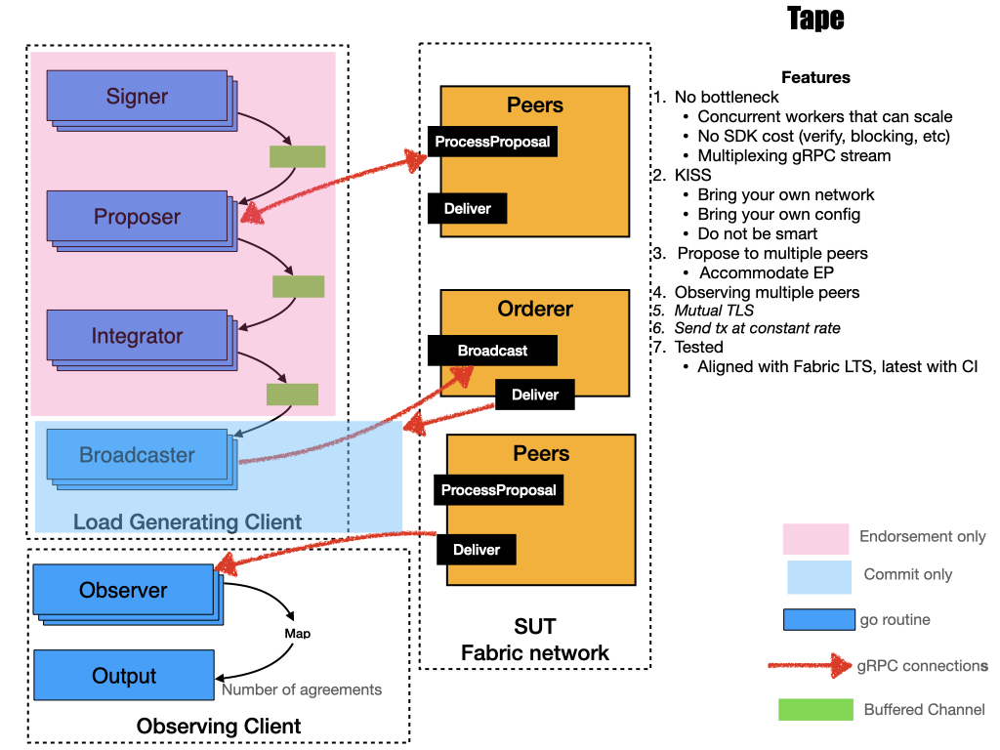

# workflow

Tape consists of several workers that run in goroutines, so that the pipeline is highly concurrent and scalable. Workers are connected via buffered channels, so they can pass products around.

workflow diagram as:

- **Signer**，create and sign a tx, prepare sending to peer for endorsement；
- **Proposer**，sending tx proposal to peer, sending it to peer for endorsemnt, and once recevied peer's response put response into a channel(a Golang element).
- **Integrator**，collection for all endorsement responses from peers, making envelope.
- **Broadcaster**，get envelop and sending to orderer.
- **Observer**，receive peer events once block been committed, and calculate tps etc...